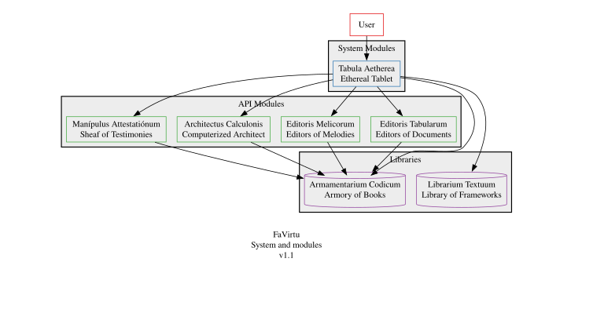
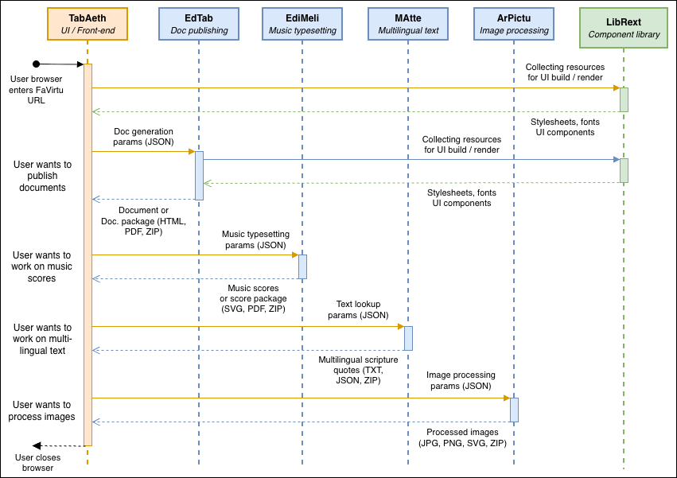
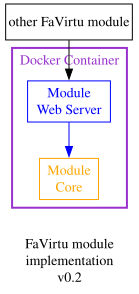
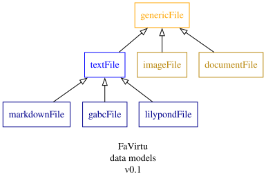

# FaVirtu (Fabrica Virtualis / Virtual Workshop)

The GSI Workspace

---

**FaVirtu** is the GSI's virtual workspace, where users can access the modules that we've created. Under the hood, this is where GSI modules are integrated together into a complete functioning system.

> STATUS (XXVIII Octobris MMXXV)  
On Hold -- Under active redesign

## DESIGN

- [System](./static/design/system.md)
- [FaVirtu Module](./static/design/favi-module.md)
- [API Modules](./static/design/api-modules.md)
- [Library Modules](./static/design/libraries.md)
- [Data Models](./static/design/data-models.md)
- [Milestones/Roadmap](./static/design/milestones.md)

### Modules

Planned software modules for the system:

### System Modules

| Module | Slug | Full name | Role |
| --- | --- | --- | --- |
| **FaVirtu** | `favirtu` | Fabrica Virtualis / Virtual Workspace | GSI Workspace | 
| **TabAeth** | `tabaeth` | Tabula Aetherea / Ethereal Tablet | System UI for the GSI Workspace | 

### API Modules

| Module | Slug | Full name | Role |
| --- | --- | --- | --- |
| **EdiMeli** | `edimeli` | Editoris Melicorum / Editors of Melodies | Music typesetting tools | 
| **EdTab** | `edtab` | Editoris Tabularum / Editors of Documents | Document publishing tools | 
| **ArchAlc** | `archalc` | Architectus Calculonis / Computerized Architect | 2D design / 3D modelling tools |
| **ArPictu** | `arpictu` | Artifex Picturarum | Image processing tools |
| **MAtte** | `matte` | Manípulus Attestatiónum / Sheaf of Testimonies | Building multilingual parallel scripture passages |

### Libraries

| Library | Slug | Full name | Role |
| --- | --- | --- | --- |
| **LibRext** | `librext` | Librarium Textuum / Library of Frameworks | UI design system and component library |
| **ArCodi** | `arcodi` | Armamentarium Codicum / Armory of Books | Code and function library. |

### Typical Use Cases

#### BROWSER

1. User accesses the system through their web browser.
1. User directs their browser to the TabAeth web page.
1. As the user interacts with the TabAeth UI, the TabAeth server interacts with the other FaVirtu modules via REST API.

#### COMMAND LINE INTERFACE

...

## FaVirtu MODULES

**FaVirtu** modules are packaged like so:

1. Modules use a **Docker container** which hosts the
1. **Module Web Server** that exposes functionality from
1. the **Module Core**

This implementation allows users to tweak configurations as necessary. For customizing how these modules fit together, adding their own to the cluster, etc.

For more information, please see [FaVirtu Modules](static/design/module.md)

## DATA MODELS

**FaVirtu** is designed to handle the following file types:

For more information, please see [FaVirtu Data Models](static/design/data-models.md)
