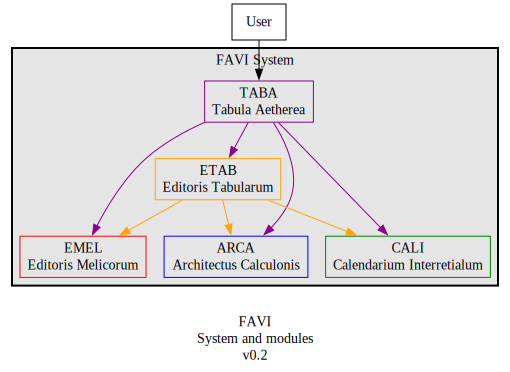

# Fabrica Virtualis (FAVI)

Virtual Workspace for GSI

---

**FAVI** is the GSI's Virtual Workspace, where users can access the modules that we've created. Under the hood, this is where modules are integrated together into a complete functioning system.

> STATUS (VII Augustii MMXXV)  
Planning stage

## ARCHITECTURE

**FAVI** will be composed of:

| Module | Full name | Transl. name | Role |
| --- | --- | --- | --- |
| TABA | Tabula Aetherea | Ethereal Tablet | System UI for the GSI Workspace | 
| EMEL | Editoris Melicorum | Editors of Melodies | GSI's music typesetting toolkit | 
| ETAB | Editoris Tabularum | Editors of Documents | GSI's document typesetting toolkit | 
| ARCA | Architectus Calculonis | Computerized Architect | GSI's 2D/3D modelling toolkit |

### TABA

Tabula Aetherea is GSI's System UI, the main interface for the apps we've created. When users access the TABA front-end the TABA server will use the appropriate FAVI module to complete tasks.

### EMEL

This project aims to create a digital music typesetting toolkit for use by music ministries in Catholic parishes. The toolkit helps with building musical arrangements around traditional hymns in Gregorian notation. As well as laying them out into documents, both for the congregation and the choir/musicians.

### ETAB

Editoris Tabularum is GSI's upcoming document typesetting toolkit, which will build document layouts from diverse sources and file types.

### ARCA

Architectus Calculonis is GSI's upcoming 2D/3D modelling toolkit, a parametric design tool for creating 2D designs and 3D models.

### MODULES

**FAVI** modules are packaged like so:

1. Modules use a **Docker container** which hosts a:
1. **Web server** that exposes functionality from:
1. the **Core module**

#### Tech Stacks

The base Docker image and web server platform should match the core module's tech stack.

| Module | Core Techs | Notes |
| --- | --- | --- |
| TABA | JavaScript, Node, Next, Electron | ... |
| EMEL | Python, LilyPond | ... |
| ETAB | Python, Pandoc | ... |
| ARCA | Python, FreeCAD | ... |
