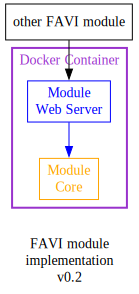

# Fabrica Virtualis (FAVI)

Virtual Workspace for GSI

---

**FAVI** is the GSI's Virtual Workspace, where users can access the modules that we've created. Under the hood, this is where modules are integrated together into a complete functioning system.

> STATUS (VII Augustii MMXXV)  
Planning stage

## DESIGN DOCUMENTS

- [FAVI System](static/design/favi-system.md)
- [FAVI Modules](static/design/favi-module.md)
- [FAVI Data Models](static/design/favi-data-models.md)

## ARCHITECTURE

**FAVI** will be composed of:

| Module | Full name | Transl. name | Role |
| --- | --- | --- | --- |
| TABA | Tabula Aetherea | Ethereal Tablet | System UI for the GSI Workspace | 
| EMEL | Editoris Melicorum | Editors of Melodies | GSI's music typesetting toolkit | 
| ETAB | Editoris Tabularum | Editors of Documents | GSI's document typesetting toolkit | 
| ARCA | Architectus Calculonis | Computerized Architect | GSI's 2D/3D modelling toolkit |

### Main Modules

#### TABA

https://github.com/guild-st-isidore-TO/tabula-aetherea

Tabula Aetherea is GSI's System UI, the main interface for the apps we've created. When users access the TABA front-end, the TABA server will use the appropriate FAVI module to complete tasks.

#### EMEL

https://github.com/guild-st-isidore-TO/editorismelicorum

Editoris Melicorum is a digital music typesetting toolkit for music ministries in Catholic parishes. The toolkit helps build musical arrangements around traditional hymns in Gregorian notation. As well as laying them out into documents, both for the congregation and the choir/musicians.

#### ETAB

https://github.com/guild-st-isidore-TO/editoristabularum

The Editoris Tabularum is a digital typesetting toolkit for creating documents like prayer booklets, mass and liturgical programs, parish announcements, etc.

#### ARCA

https://github.com/guild-st-isidore-TO/architectuscalculonis

The Architectus Calculonis is a parametric 2D/3D modelling toolkit that creates 2D designs and 3D models through Python scripts.

## MODULE STRUCTURE

**FAVI** modules are packaged like so:

1. Modules use a **Docker container** which hosts a:
1. **Web server** that exposes functionality from:
1. the **Core module**

This implementation allows users to tweak configurations as necessary. For customizing how these modules fit together, adding their own to the cluster, etc.

#### Tech Stacks

The base Docker image and web server platform should match the core module's tech stack.

| Module | Core Techs | Notes |
| --- | --- | --- |
| TABA | JavaScript, Node, Next, Electron | ... |
| EMEL | Python, LilyPond | ... |
| ETAB | Python, Pandoc | ... |
| ARCA | Python, FreeCAD | ... |

## DATA MODEL

