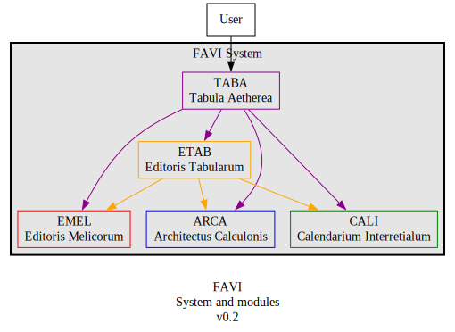

# FAVI System

Back to [main README](../../README.md)

---

**FAVI** will be a Docker cluster composed of the following main modules:

| Module | Full name | Transl. name | Role |
| --- | --- | --- | --- |
| [TABA](https://github.com/guild-st-isidore-TO/tabula-aetherea) | Tabula Aetherea | Ethereal Tablet | System UI for the GSI Workspace | 
| [EMEL](https://github.com/guild-st-isidore-TO/editorismelicorum) | Editoris Melicorum | Editors of Melodies | GSI's music typesetting toolkit | 
| [ETAB](https://github.com/guild-st-isidore-TO/editoristabularum) | Editoris Tabularum | Editors of Documents | GSI's document typesetting toolkit | 
| [ARCA](https://github.com/guild-st-isidore-TO/architectuscalculonis) | Architectus Calculonis | Computerized Architect | GSI's 2D/3D modelling toolkit |

### Typical Use Case

1. User accesses the system through their web browser.
1. User directs their browser to the TABA web page.
1. As the user interacts with the TABA UI, the TABA server interacts with the other FAVI modules via REST API.

### Data flow

User interactions are expected to have this data flow:

1. On TABA front-end, user selects an available FAVI function
1. On the corresponding TABA page for that FAVI function, user makes changes to app behaviour (configs)
1. On the same page, user selects the relevant files and data (inputs)
1. On the same page, user triggers FAVI function
1. TABA back-end sends user's configs and input data to FAVI module's web server
1. FAVI module server runs module's core function using the user's configs and inputs
1. FAVI module core returns valid data, or throws an exception
1. FAVI module server returns valid data or exception data
1. TABA back-end parses data from FAVI module
1. TABA front-end shows valid result, or error message

### Main Modules

#### TABA

https://github.com/guild-st-isidore-TO/tabula-aetherea

Tabula Aetherea is GSI's System UI, the main interface for the apps we've created. When users access the TABA front-end, the TABA server will use the appropriate FAVI module to complete tasks.

#### EMEL

https://github.com/guild-st-isidore-TO/editorismelicorum

Editoris Melicorum is a digital music typesetting toolkit for music ministries in Catholic parishes. The toolkit helps build musical arrangements around traditional hymns in Gregorian notation. As well as laying them out into documents, both for the congregation and the choir/musicians.

#### ETAB

https://github.com/guild-st-isidore-TO/editoristabularum

The Editoris Tabularum is a digital typesetting toolkit for creating documents like prayer booklets, mass and liturgical programs, parish announcements, etc.

#### ARCA

https://github.com/guild-st-isidore-TO/architectuscalculonis

The Architectus Calculonis is a parametric 2D/3D modelling toolkit that creates 2D designs and 3D models through Python scripts.
